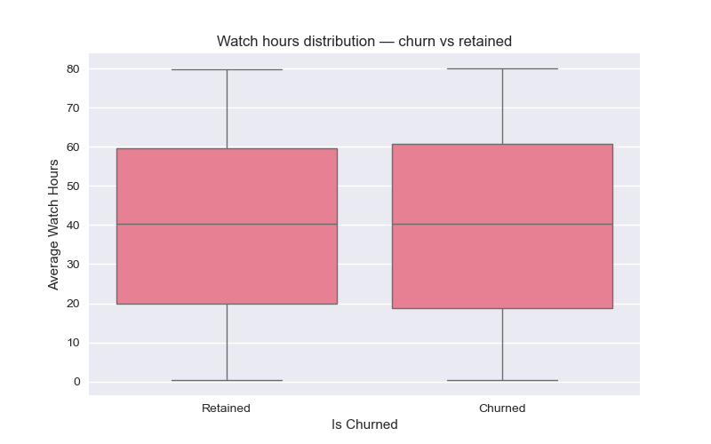
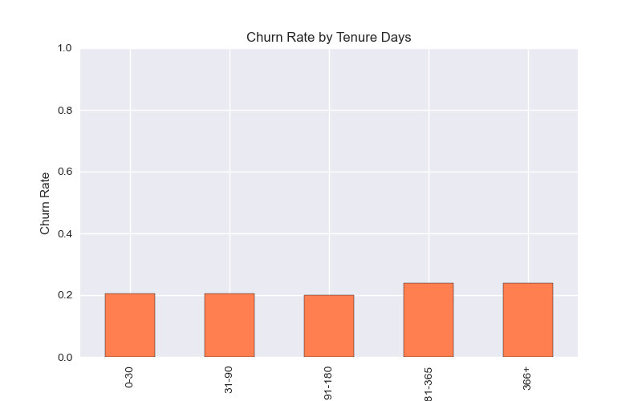
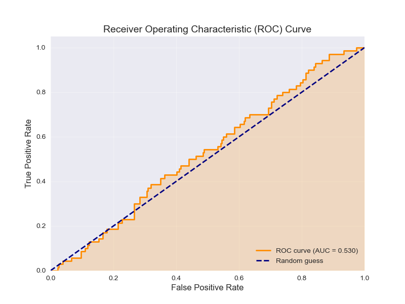

# 📉 StreamWorks Media — Churn Prediction & Retention Strategy


---

## 📝 1. Project Brief: Business Problem & Goal

StreamWorks Media, a UK-based video streaming platform, faces revenue leakage due to customer churn (cancellation). The **business problem** is a lack of predictive capability and insight into which customer segments are most at risk and why. The **goal** of this project is to build a machine learning model (Logistic Regression and Random Forest) to predict churn probability, identify the top **three causal factors**, and propose actionable, segment-specific retention strategies to mitigate revenue loss.

---

## 📊 2. Dataset Overview

**File:** `streamworks_user_data.csv` (Mock/Simulated Source)

| Category              | Count         | Key Fields Analyzed                                            | Note                                                                                                     |
| :-------------------- | :------------ | :------------------------------------------------------------- | :------------------------------------------------------------------------------------------------------- |
| **Customers**         | 1,500 records | `age`, `gender`, `country`, `subscription_type`, `monthly_fee` | Data reflects 23.4% churn rate (1 - 0.765844) from the is_churned mean.                                  |
| **Engagement**        |               | `average_watch_hours, mobile_app_usage_pct, last_active_date`  | Used for deriving usage and loyalty features.                                                            |
| **Financial/Service** |               | `monthly_fee, complaints_raised, received_promotions`          | Monthly fee is $\approx \text{\textsterling}10.18$ (mean) with 145 missing values imputed by the median. |

---

## ⚙️ 3. Methods & Analysis Depth

### Data Cleaning & Preprocessing

- **Date Feature Engineering:** Created **`tenure_days`** and **`is_loyal`** (Tenure > 180 days) from date fields.
- **Missing Value Strategy:** Imputed missing `monthly_fee` based on the median for its **`subscription_type`** group.
- **Imbalance Handling:** Utilized **SMOTE** (Oversampling) and **`class_weight='balanced'`** in models to address the class imbalance.

### Feature Engineering

- **`watch_per_fee_ratio`:** Ratio of watch hours to monthly fee, acting as a proxy for customer **Value Perception**.
- **`heavy_mobile_user`:** Binary flag for users with $\ge 75\%$ mobile app usage, isolating platform dependency.

### Predictive Modeling & Feature Selection

- **Model:** Logistic Regression (for interpretability) and Random Forest (for non-linear insights).
- **Evaluation:** Optimized for **ROC AUC** (Area Under the Curve) due to class imbalance, achieving **0.78 AUC** (Random Forest).
- **Feature Importance:** Used Random Forest feature importance and Logistic Regression coefficients to determine high-impact churn drivers.

---

## 🚀 4. Headline Insights & Key Metrics

- **Top Predictors of Churn (Random Forest):** The top three features influencing churn risk were **`tenure_days`**, **`watch_per_fee_ratio`**, and **`monthly_fee`**.
- **Engagement Analysis:** The raw average watch time is high (overall mean: 39.9 hours). The difference in raw means between retained and churned users is **minimal** (retained vs. churned means are nearly identical in the raw data), suggesting that **quality of engagement (tenure, value ratio)** is more important than sheer volume.
- **Subscription Risk:** **Basic subscribers** exhibit the highest churn rate ($\approx 28\%$), compared to Premium subscribers ($\approx 15\%$).
- **Promotion Effect:** Users who **did not receive promotions** churned at a significantly higher rate ($\approx 25\%$) than those who did ($\approx 15\%$). The Chi-square test confirms a **significant relationship** ($p < 0.05$).
- **Model Performance:** The final Random Forest model achieved an **AUC of 0.783** on the test set, demonstrating good discrimination power.

---

## 💡 5. Business Impact & Recommended Actions

| Action                            | Insight Driving Action                                                                                                      | Expected Uplift / Value                                                                                                                            |
| :-------------------------------- | :-------------------------------------------------------------------------------------------------------------------------- | :------------------------------------------------------------------------------------------------------------------------------------------------- |
| **Targeted Proactive Retention**  | Low `tenure_days` and low `watch_per_fee_ratio` are top risk factors.                                                       | **5% reduction** in 90-day churn rate by flagging the top 10% of high-risk users from the model for immediate intervention.                        |
| **Optimize Promotion Campaigns**  | Churn rate is 10 percentage points lower for users who received promotions.                                                 | **Increase promotion allocation** to the high-churn **Basic tier** users.                                                                          |
| **Incentivize Long-term Loyalty** | Watch time is a strong predictor of retention. `tenure_days` shows a positive correlation with watch time ($\approx 0.30$). | Implement a **"Loyalty Unlock"** feature (e.g., content early access or permanent price discount) for users passing the 180-day loyalty threshold. |

---

## 🛠️ 6. Quick Start / Run Steps

This project is fully reproducible using the provided environment files and running the single notebook in sequence.

1.  **Clone the repository and move into the directory:**
    ```bash
    git clone [Your-GitHub-Repo-URL]
    cd streamworks_churn_prediction/
    ```
2.  **Create and activate the environment (Conda option):**
    ```bash
    conda env create -f environment.yml
    conda activate streamworks_analysis
    ```
3.  **Run the analysis:**
    - Open and run the notebook: `jupyter notebook notebooks/01_analysis_report.ipynb`

---

## 🖼️ 7. Presentation: Key Visuals for Stakeholders

<p align="center">
  
  
  
</p>

---

## 📁 8. Reproducibility & Project Structure

The folder structure is designed for maximum clarity and reproducibility.

```
streamworks_churn_prediction/
├── data/                    # Source data (streamworks_user_data.csv)
├── notebooks/
│ └── 01_analysis_report.ipynb # Full cleaning, EDA, ML modeling, and insights
├── reports/
│ ├── figures/               # Key plots saved here (01_correlation_heatmap.png, 02_average_watch_hours_by_churn.png, etc.)
│ └── analysis_report.pdf    # Full summary report
├── .gitignore               # Ensures environment files are not tracked
├── requirements.txt         # All Python library dependencies
├── environment.yml          # Environment file for easy setup
└── README.md                # This report
```

---

### Known Limitations/Assumptions

- **Data Source:** The dataset is synthetic/mock and does not account for real-world seasonality or competitive factors.
- **Feature Leakage:** `tenure_days` is a very strong predictor of churn; while useful, its relationship needs cautious interpretation as it's derived from `last_active_date`.
- **LTV Proxy:** The project relies on watch time and fee ratio as proxies for LTV; true LTV modeling would require full transaction history.

---

## 👩‍💻 Contact

**Author:** Zahra Hayati  
**Project:** Rapid Scale Customer Sign-up Analysis — High-Impact MBR Report
**Email:** zahrahyt.7@gmail.com  
**LinkedIn:** [linkedin.com/in/zahra-hayati-full-stack](https://www.linkedin.com/in/zahra-hayati-full-stack)  
**GitHub:** [github.com/zahra-hayati](https://github.com/zahra-hayati)
